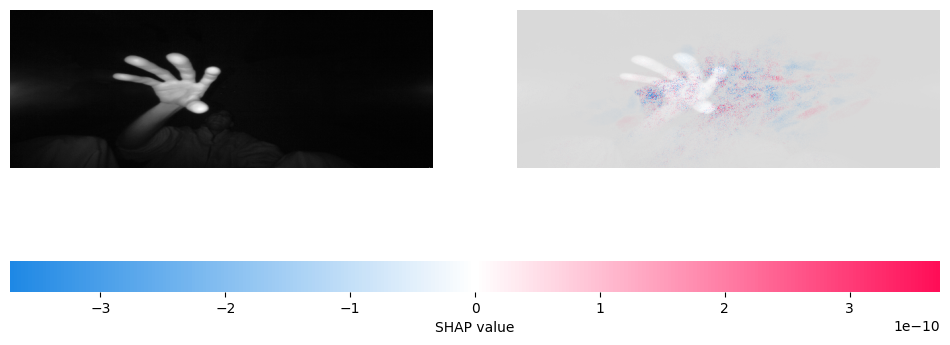
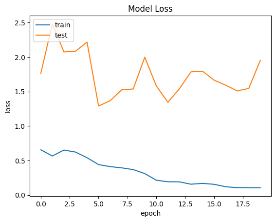
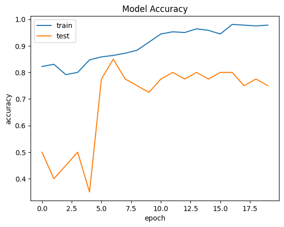
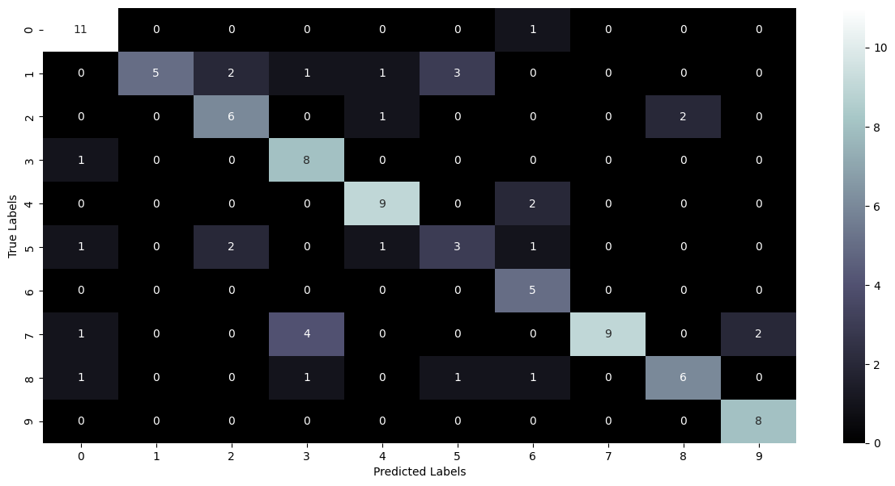

# Hand Gesture Image Classification with Neural Networks & SHAP

A 10-class hand-gesture image-classification project built with **TensorFlow/Keras** using the **LeapGestRecog** dataset, with model evaluation and **SHAP** explainability.

> **Important scope note:** this project classifies stored grayscale gesture images captured with a Leap Motion sensor. It is **not** a live webcam or real-time gesture-recognition system.



## Project overview

The project started from an open-source Kaggle dataset and starter notebook. During the course project, the dataset/class mapping was corrected so that each of the 10 distinct hand gestures was assigned its own class ID.

The final workflow:

1. downloads the LeapGestRecog dataset;
2. maps each gesture to one of 10 distinct classes;
3. loads and preprocesses grayscale images;
4. trains a multilayer perceptron (MLP);
5. evaluates predictions with accuracy, a confusion matrix, and a classification report; and
6. uses SHAP `GradientExplainer` to inspect model predictions.

## Gesture classes

| Class | Gesture |
|---:|---|
| 0 | `01_palm` |
| 1 | `02_l` |
| 2 | `03_fist` |
| 3 | `04_fist_moved` |
| 4 | `05_thumb` |
| 5 | `06_index` |
| 6 | `07_ok` |
| 7 | `08_palm_moved` |
| 8 | `09_c` |
| 9 | `10_down` |

## Model

The recorded project uses an MLP:

- input: flattened `240 × 640` grayscale image;
- Dense(64) + LeakyReLU;
- Dense(32) + LeakyReLU;
- Dense(16) + LeakyReLU;
- Dense(10) + Softmax.

The model is trained with Adam and sparse categorical cross-entropy.

## Recorded results

The supplied course notebook contains a recorded run using:

- **500 total images**;
- **400 training images**;
- **100 test images**;
- **20 epochs**;
- **70.0% test accuracy**;
- **0.69 macro F1-score**;
- **0.69 weighted F1-score**.

These values describe that specific recorded execution and should not be treated as guaranteed performance across different samples or random seeds.

### Training curves

| Loss | Accuracy |
|---|---|
|  |  |

### Confusion matrix



### Example SHAP explanation

The recorded notebook includes a correctly classified `10_down` example with 99.96% model confidence and a SHAP visualization.


SHAP is used here to inspect model behavior. It does **not** by itself establish that the model is fair, unbiased, or production-ready.

## My contributions and team attribution

This repository is based on a **three-person CYBR 422 team project**.

My documented contributions included:

- working on most of the model codebase;
- reorganizing and correcting the dataset/class mapping;
- helping shape the project direction; and
- preparing the final presentation.

The SHAP explainability component was part of the team project and was primarily developed by another team member. It is included here because it was integrated into the final shared project notebook.

This attribution is intentional so the repository accurately represents both my work and the collaborative nature of the course project.

## Repository structure

```text
hand-gesture-classification-shap/
├── README.md
├── requirements.txt
├── .gitignore
├── ACKNOWLEDGMENTS.md
├── images/
│   ├── training_loss.png
│   ├── training_accuracy.png
│   ├── sample_prediction.png
│   ├── confusion_matrix.png
│   └── shap_explanation.png
└── notebooks/
    └── hand_gesture_classification_shap.ipynb
```

## Run the project

### Google Colab

Open the notebook in `notebooks/` and run the cells in order.

If a package is missing, install the dependencies:

```bash
pip install -r requirements.txt
```

The notebook downloads the dataset through `kagglehub`, so the full dataset is intentionally **not** stored in this repository.

## Limitations

This is an academic proof of concept, not a production model.

Important limitations:

- the recorded run used a 500-image sample rather than the entire dataset;
- the MLP flattens each image, so it does not preserve spatial structure like a CNN;
- results can vary with sampling and random initialization;
- a subject-aware train/test split would be a stronger generalization test;
- SHAP provides local/model explanations, not a guarantee of trustworthiness; and
- real-time gesture recognition would require a Leap Motion sensor and a separate sensor/inference pipeline.

## Future improvements

- replace the MLP with a CNN;
- train on the full dataset;
- add subject-aware cross-validation;
- save and version the best-performing model;
- add per-class ROC/PR analysis where appropriate;
- test inference on new Leap Motion samples; and
- build a real-time pipeline if Leap Motion hardware is available.

## Academic integrity and source attribution

This project uses the public **LeapGestRecog** dataset from the `gti-upm/leapgestrecog` Kaggle dataset and was developed from an open-source Kaggle starter notebook as part of CYBR 422 coursework. The repository does not claim authorship of the dataset or of third-party starter code.

See `ACKNOWLEDGMENTS.md` for details.
